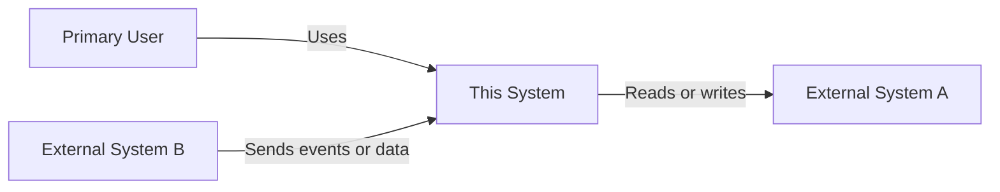
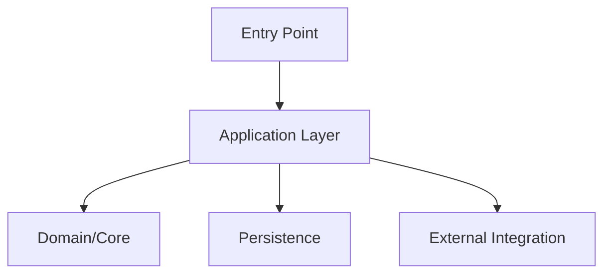
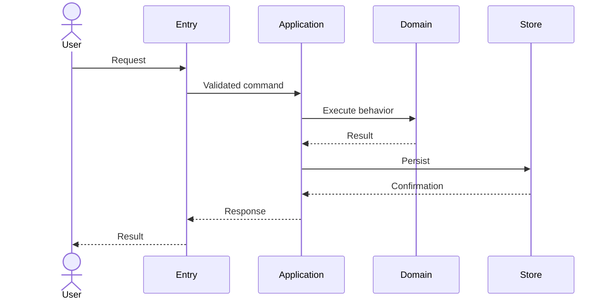
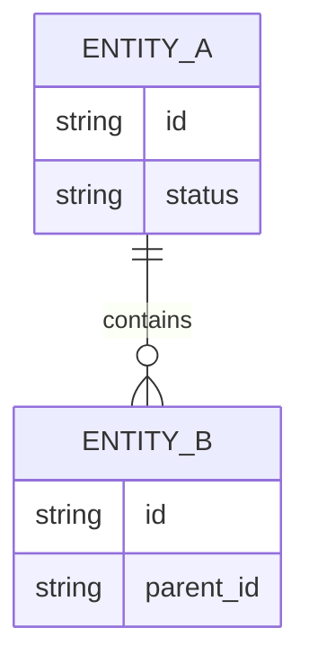
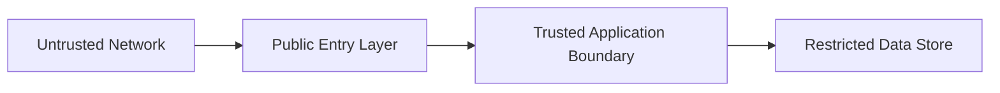
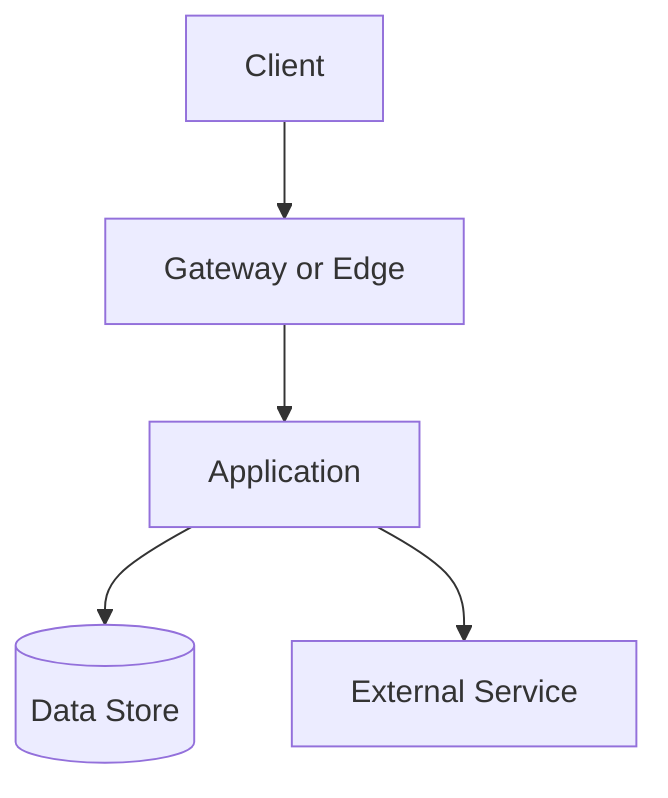

# Architecture

This document describes the current architecture of the project.

It is intended for developers, architects, reviewers, operators, and coding agents. Keep it evidence-based and aligned with the repository as it exists today. Future proposals belong in implementation plans or architecture decision records, not in this document unless they have been approved and implemented.

Replace every `<...>` placeholder before treating this document as authoritative. Remove sections that do not apply.

## Document status

- **Project:** <project name>
- **Architecture status:** Draft | Current | Transitional | Deprecated
- **Owners:** <team, role, or individuals>
- **Last reviewed:** <YYYY-MM-DD>
- **Repository basis:** <branch, release, tag, or commit>
- **Related context:** `docs/PROJECT_CONTEXT.md`
- **Architecture decisions:** `docs/adr/`

## Purpose

This document explains:

- the system's major components and responsibilities
- architectural boundaries and dependency direction
- runtime interactions and control flow
- data ownership, persistence, and movement
- public and internal interfaces
- external integrations
- security and trust boundaries
- deployment and operational topology
- quality attributes and architectural constraints
- known limitations, risks, and extension points

It does not define product requirements, implementation task lists, or speculative future architecture.

## Architecture summary

<Describe the architecture in three to five sentences. State the system style, major components, deployment model, and the most important architectural constraint.>

Example structure:

> The system is a <monolith/modular monolith/service-oriented system/library/desktop application/etc.> composed of <major components>. Requests enter through <entry point>, pass through <main layers>, and persist data in <storage>. External communication occurs through <interfaces>. The architecture prioritizes <quality attributes> and preserves <critical boundary or invariant>.

## Scope

### In scope

This architecture document covers:

- <application, service, package, or repository boundary>
- <runtime components>
- <data stores>
- <integrations>
- <deployment model>

### Out of scope

This document does not cover:

- <system or process owned elsewhere>
- <infrastructure documented elsewhere>
- <client or integration outside the repository>
- <business process that is not implemented here>

### Related architecture documents

| Topic | Document |
|---|---|
| Project purpose and boundaries | `docs/PROJECT_CONTEXT.md` |
| Development workflow | `docs/DEVELOPMENT.md` |
| Testing strategy | `docs/TESTING.md` |
| Security guidance | `docs/SECURITY.md` |
| Architecture decisions | `docs/adr/` |
| Operations or runbooks | `<path>` |

Remove entries that do not exist.

## Architectural principles

The architecture follows these principles:

- <principle>
- <principle>
- <principle>

Common examples include:

- business rules remain independent of transport and storage
- dependencies point inward toward stable abstractions
- integrations are isolated behind explicit interfaces
- configuration is externalized
- side effects occur at well-defined boundaries
- failures are explicit and observable
- public contracts are versioned and backwards-compatible
- sensitive data is minimized and protected
- generated code is not edited manually

Only include principles that are actually reflected in the repository.

## Architectural constraints

These constraints materially shape the system:

| Constraint | Source | Architectural effect |
|---|---|---|
| <constraint> | <business, technical, legal, platform, or organizational source> | <effect> |
| <constraint> | <source> | <effect> |

Examples:

- required runtime or operating system
- deployment platform
- database technology
- network restrictions
- compatibility guarantees
- latency or throughput targets
- regulatory obligations
- approved dependency set
- organizational ownership boundaries

Clearly distinguish mandatory constraints from preferences.

## System context

### Context description

<Describe the system in relation to its users and external systems. Explain who initiates interactions, what information crosses the boundary, and which external systems are authoritative.>

### Context diagram

Use Mermaid only when it improves understanding.



Replace the example with the actual context or remove it.

### Actors and external systems

| Actor or system | Relationship | Interface | Data exchanged | Ownership |
|---|---|---|---|---|
| <actor/system> | <relationship> | <API, UI, event, file, database, or manual process> | <data> | <owner> |

## Repository architecture

### Repository structure

| Path | Responsibility | Ownership |
|---|---|---|
| `<path>` | <responsibility> | <team or module> |
| `<path>` | <responsibility> | <team or module> |

### Monorepo or multi-package structure

Use this section only when applicable.

| Package or service | Path | Responsibility | Public interface | Allowed dependencies |
|---|---|---|---|---|
| <name> | `<path>` | <responsibility> | <interface> | <dependencies> |

### Dependency direction

Document the intended direction of dependencies.

```text
<outer layer> -> <application layer> -> <domain/core layer>
```

Rules:

- <dependency rule>
- <dependency rule>
- <prohibited dependency>

If dependency rules are enforced by tooling, document the tool and configuration path.

## Major components

### Component overview

| Component | Responsibility | Inputs | Outputs | Key dependencies |
|---|---|---|---|---|
| <component> | <responsibility> | <inputs> | <outputs> | <dependencies> |

### Component diagram



Replace the example or remove it.

### Component details

#### <Component name>

- **Path:** `<path>`
- **Responsibility:** <responsibility>
- **Public interface:** <interface>
- **Internal dependencies:** <dependencies>
- **External dependencies:** <dependencies>
- **State owned:** <state or `None`>
- **Failure behavior:** <behavior>
- **Scaling characteristics:** <characteristics>
- **Security relevance:** <relevance>
- **Tests:** `<path>`

Repeat for each major component.

## Runtime architecture

### Entry points

| Entry point | Path or address | Trigger | Responsibility |
|---|---|---|---|
| <entry point> | `<path or endpoint>` | <trigger> | <responsibility> |

Examples include:

- HTTP or RPC endpoints
- command-line entry points
- background jobs
- event consumers
- scheduled tasks
- desktop or mobile entry points
- library APIs
- file watchers
- webhook handlers

### Request or command flow

Describe the normal control flow.

1. <entry point receives input>
2. <validation occurs>
3. <application logic is invoked>
4. <domain rules are applied>
5. <state or integrations are updated>
6. <result is returned or emitted>

### Runtime sequence



Replace or remove the example.

### Background and asynchronous processing

| Process | Trigger | Frequency | Responsibility | Failure handling |
|---|---|---|---|---|
| <process> | <trigger> | <frequency> | <responsibility> | <handling> |

Document:

- concurrency model
- retry behavior
- idempotency
- ordering guarantees
- deduplication
- dead-letter or failure handling
- scheduling
- ownership

Use `Not applicable` when the system has no asynchronous processing.

### State management

Describe:

- in-memory state
- request-scoped state
- distributed state
- caches
- session state
- local files
- synchronization mechanisms
- invalidation behavior

## Data architecture

### Data ownership

| Data set or entity | Owner | System of record | Storage | Access pattern |
|---|---|---|---|---|
| <data> | <owner> | <system> | <storage> | <pattern> |

### Data model

Summarize the main entities and relationships.



Replace or remove the example.

### Persistence

| Store | Technology | Purpose | Data classification | Backup or recovery |
|---|---|---|---|---|
| <store> | <technology> | <purpose> | <classification> | <approach> |

### Transactions and consistency

Document:

- transaction boundaries
- atomicity requirements
- consistency model
- locking or concurrency controls
- duplicate handling
- retry safety
- reconciliation
- eventual-consistency behavior

### Caching

| Cache | Purpose | Scope | Invalidation | Failure behavior |
|---|---|---|---|---|
| <cache> | <purpose> | <scope> | <strategy> | <behavior> |

Use `Not applicable` when no cache exists.

### Data migration

Document:

- migration tool and location
- backwards-compatibility strategy
- deployment order
- rollback or forward-recovery approach
- data validation
- ownership
- restrictions on destructive changes

Reference detailed procedures in development or operations documentation.

### Data retention and deletion

Summarize:

- retention rules
- deletion or anonymization process
- archival behavior
- legal holds
- user-requested deletion
- backup implications

Do not include sensitive records or production data examples.

## Interfaces and contracts

### Public interfaces

| Interface | Type | Location | Consumers | Compatibility policy |
|---|---|---|---|---|
| <interface> | REST, RPC, CLI, library, event, file, UI | `<path or endpoint>` | <consumers> | <policy> |

### Internal interfaces

| Interface | Provider | Consumers | Stability |
|---|---|---|---|
| <interface> | <provider> | <consumers> | Stable / Internal / Experimental |

### API behavior

Document:

- versioning
- authentication
- authorization
- validation
- error model
- pagination
- idempotency
- rate limits
- deprecation
- compatibility guarantees

### Events and messages

| Event or message | Producer | Consumers | Schema | Delivery semantics |
|---|---|---|---|---|
| <event> | <producer> | <consumers> | `<path>` | At-most-once / At-least-once / Exactly-once-like |

Document ordering, duplication, retries, schema evolution, and failure handling.

Use `Not applicable` if the system does not use messaging.

### File and batch interfaces

| Interface | Format | Producer | Consumer | Validation |
|---|---|---|---|---|
| <interface> | <format> | <producer> | <consumer> | <validation> |

Use `Not applicable` when absent.

## External integrations

### Integration inventory

| Integration | Purpose | Direction | Protocol | Authentication | Owner |
|---|---|---|---|---|---|
| <system> | <purpose> | Inbound / Outbound / Bidirectional | <protocol> | <method> | <owner> |

### Integration boundaries

For each important integration, document:

- source of truth
- data contract
- timeout behavior
- retry policy
- idempotency
- rate limits
- circuit breaking or fallback
- failure visibility
- reconciliation
- privacy and security constraints
- sandbox or test strategy

### Integration failure modes

| Failure | Expected behavior | User impact | Operational signal |
|---|---|---|---|
| <failure> | <behavior> | <impact> | <signal> |

## Security architecture

### Trust boundaries

Describe the boundaries across which trust changes.



Replace or remove the example.

### Authentication

Document:

- identities
- authentication provider
- credential or token type
- token validation
- session handling
- machine-to-machine authentication
- expiry and revocation
- relevant configuration locations

### Authorization

Document:

- authorization model
- role or permission ownership
- enforcement points
- resource-level checks
- service-to-service permissions
- administrative access
- audit expectations

### Input and output security

Document:

- validation boundaries
- encoding
- serialization
- file handling
- path handling
- injection prevention
- upload constraints
- content-type handling

### Secrets

Document:

- approved secret-management mechanism
- local-development approach
- deployment injection
- rotation ownership
- prohibited storage locations

Do not include actual secret names when they reveal sensitive operational details.

### Sensitive data

Summarize:

- data classification
- encryption in transit
- encryption at rest
- masking or redaction
- logging restrictions
- access controls
- retention
- deletion
- auditability

### Security controls

| Control | Purpose | Enforcement point | Verification |
|---|---|---|---|
| <control> | <purpose> | <location> | <test or review> |

## Deployment architecture

### Deployment model

<Describe how the system is packaged and deployed.>

Examples:

- single executable
- containerized service
- serverless functions
- desktop package
- mobile application
- static site
- library package
- multi-service deployment

### Environment topology

| Environment | Purpose | Runtime | Data | Access |
|---|---|---|---|---|
| Local | Development | <runtime> | <data> | Developer |
| Test | <purpose> | <runtime> | <data> | <access> |
| Staging | <purpose> | <runtime> | <data> | <access> |
| Production | Live operation | <runtime> | <data> | <access> |

Remove environments that do not exist.

### Deployment diagram



Replace or remove the example.

### Build and release flow

Describe:

1. source validation
2. artifact creation
3. artifact storage
4. environment promotion
5. deployment
6. smoke checks
7. rollback or recovery

Reference CI/CD configuration paths.

### Configuration

Document:

- configuration sources
- environment variables
- configuration files
- feature flags
- secret injection
- validation
- defaults
- environment differences
- reload behavior

### Rollout and rollback

Document:

- deployment order
- staged rollout
- feature flags
- canary behavior
- compatibility window
- rollback conditions
- rollback limitations
- data-recovery strategy

## Operational architecture

### Observability

| Signal | Purpose | Location or tool | Owner |
|---|---|---|---|
| Logs | <purpose> | <location> | <owner> |
| Metrics | <purpose> | <location> | <owner> |
| Traces | <purpose> | <location> | <owner> |
| Audit events | <purpose> | <location> | <owner> |

Document:

- correlation identifiers
- log levels
- sensitive-data restrictions
- key business and technical metrics
- health checks
- readiness checks
- failure visibility
- alert thresholds
- dashboards

### Health and readiness

| Check | Meaning | Dependency | Failure response |
|---|---|---|---|
| <check> | <meaning> | <dependency> | <response> |

### Failure handling and resilience

Document:

- timeout strategy
- retry strategy
- circuit breaking
- bulkheads
- graceful degradation
- queue backpressure
- overload behavior
- data reconciliation
- recovery procedures
- single points of failure

### Backup and recovery

Document:

- backup scope
- backup frequency
- retention
- restore process
- recovery testing
- recovery objectives
- ownership

### Capacity and scaling

Document:

- scaling model
- known bottlenecks
- concurrency assumptions
- storage growth
- rate limits
- resource limits
- capacity signals
- scaling triggers

## Quality attributes

### Reliability

- **Expectation:** <expectation>
- **Mechanisms:** <mechanisms>
- **Verification:** <tests, monitoring, or review>

### Performance

- **Expectation:** <latency, throughput, resource, or startup expectation>
- **Critical paths:** <paths>
- **Mechanisms:** <mechanisms>
- **Verification:** <tests or monitoring>

### Scalability

- **Expectation:** <expectation>
- **Scaling dimension:** <users, requests, data, jobs, tenants>
- **Mechanisms:** <mechanisms>
- **Known limits:** <limits>

### Security

- **Expectation:** <expectation>
- **Mechanisms:** <mechanisms>
- **Verification:** <tests or review>

### Privacy

- **Expectation:** <expectation>
- **Mechanisms:** <mechanisms>
- **Verification:** <tests or review>

### Maintainability

- **Expectation:** <expectation>
- **Mechanisms:** <module boundaries, conventions, automation>
- **Verification:** <review, static analysis, architecture tests>

### Testability

- **Expectation:** <expectation>
- **Mechanisms:** <dependency isolation, test seams, fixtures>
- **Verification:** <coverage approach or test strategy>

### Accessibility

- **Expectation:** <expectation or `Not applicable`>
- **Mechanisms:** <mechanisms>
- **Verification:** <tests or review>

### Portability

- **Expectation:** <expectation or `Not applicable`>
- **Supported environments:** <environments>
- **Constraints:** <constraints>

## Cross-cutting concerns

### Error handling

Document:

- error categories
- exception or result model
- translation between layers
- user-visible error behavior
- retryable versus non-retryable failures
- logging and correlation
- security considerations

### Logging

Document:

- logging framework
- structured fields
- correlation identifiers
- prohibited data
- log ownership
- retention
- local-development behavior

### Configuration

Document:

- source precedence
- validation
- defaults
- runtime reload
- environment-specific behavior
- secret separation

### Localization

Document:

- supported locales
- translation ownership
- date, time, number, and timezone handling
- fallback behavior
- test strategy

Use `Not applicable` when absent.

### Feature flags

| Flag | Purpose | Owner | Default | Removal condition |
|---|---|---|---|---|
| <flag> | <purpose> | <owner> | On / Off | <condition> |

Document storage, evaluation, rollout, and cleanup policy.

Use `Not applicable` when absent.

### Multi-tenancy

Document:

- tenant identification
- isolation boundary
- authorization
- data partitioning
- configuration
- observability
- testing

Use `Not applicable` for single-tenant systems.

## Extension points

Document supported ways to extend the system.

| Extension point | Purpose | Contract | Stability |
|---|---|---|---|
| <extension point> | <purpose> | <interface> | Stable / Internal / Experimental |

For each extension point, document:

- ownership
- lifecycle
- compatibility
- validation
- security constraints
- examples
- prohibited uses

Do not describe accidental implementation details as supported extension points.

## Architectural decisions

Material decisions are recorded under `docs/adr/`.

### Current decisions

| ADR | Decision | Status | Affected areas |
|---|---|---|---|
| `docs/adr/<file>.md` | <decision> | Accepted | <areas> |

### Decision triggers

Create or update an ADR when changing:

- major component boundaries
- dependency direction
- persistence technology
- source-of-truth ownership
- public interfaces or compatibility policy
- authentication or authorization model
- trust boundaries
- major dependencies
- deployment model
- migration strategy
- availability or consistency model

## Known limitations and technical debt

| Limitation | Impact | Current mitigation | Owner | Tracking |
|---|---|---|---|---|
| <limitation> | <impact> | <mitigation> | <owner> | <reference> |

Only record limitations that materially affect architecture, planning, or operation.

Do not turn this section into a general backlog.

## Architectural risks

| Risk | Likelihood | Impact | Mitigation | Trigger for review |
|---|---|---|---|---|
| <risk> | Low / Medium / High | Low / Medium / High | <mitigation> | <trigger> |

## Open architecture questions

- **ARCH-Q-001:** <question>
  - **Why it matters:** <impact>
  - **Owner:** <role or team>
  - **Decision deadline or trigger:** <date or trigger>
  - **Affected components:** <components>

Remove resolved questions and record material decisions in an ADR.

## Architecture verification

The architecture is verified through:

- code review
- automated tests
- static analysis
- dependency or architecture tests
- contract tests
- deployment validation
- security review
- operational monitoring
- periodic documentation review

### Automated enforcement

| Rule | Tool or test | Configuration |
|---|---|---|
| <rule> | <tool> | `<path>` |

Use `None currently enforced` where applicable.

### Manual review checklist

Before approving an architectural change, verify:

- component responsibilities remain clear
- dependency direction is preserved
- data ownership is explicit
- public contracts are intentional
- security and trust boundaries are understood
- operational impact is addressed
- migration and rollback are feasible
- testing covers the changed boundary
- documentation and ADRs are updated

## Evidence map

Use this section to connect architectural statements to repository evidence.

| Architectural statement | Evidence |
|---|---|
| <statement> | `<path>` — <symbol, section, or configuration> |
| <statement> | `<path>` — <symbol, section, or configuration> |

This section helps prevent the document from drifting away from the implementation.

## Maintenance

Review this document when:

- a major component is introduced, removed, or split
- a public contract changes
- persistence or data ownership changes
- a new integration is added
- the deployment topology changes
- authentication or authorization changes
- a new trust boundary appears
- a major dependency is introduced
- an ADR is accepted
- operational behavior changes
- repeated planning mistakes reveal missing architectural context

During review:

- verify diagrams
- verify repository paths
- verify ownership
- verify interfaces and contracts
- verify data flows
- verify deployment and operational assumptions
- remove obsolete sections
- update the last-reviewed date
- add links to relevant ADRs

## Architecture summary for agents

Before planning or implementation, an agent should be able to answer:

- What are the major components?
- What does each component own?
- Which direction may dependencies flow?
- Where do requests, commands, events, or jobs enter?
- How does data move through the system?
- Which system owns each important data set?
- What public and internal contracts exist?
- Which integrations can fail, and how is failure handled?
- Where are the trust boundaries?
- How is the system deployed and operated?
- Which quality attributes and constraints shape design decisions?
- Which changes require an ADR or explicit architectural approval?

If this document does not provide reliable answers, inspect repository evidence and surface the gap rather than guessing.
